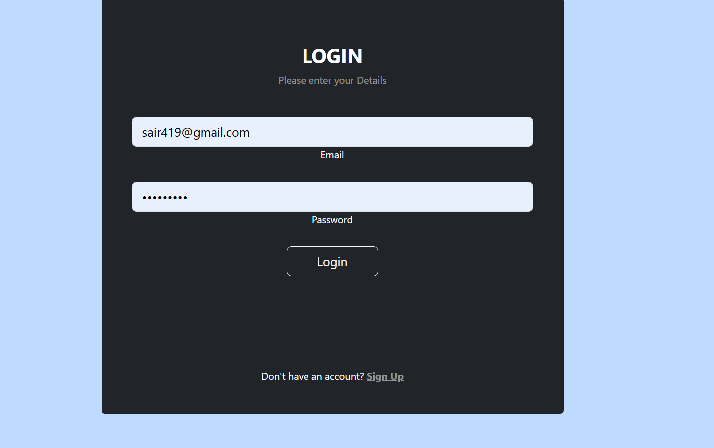
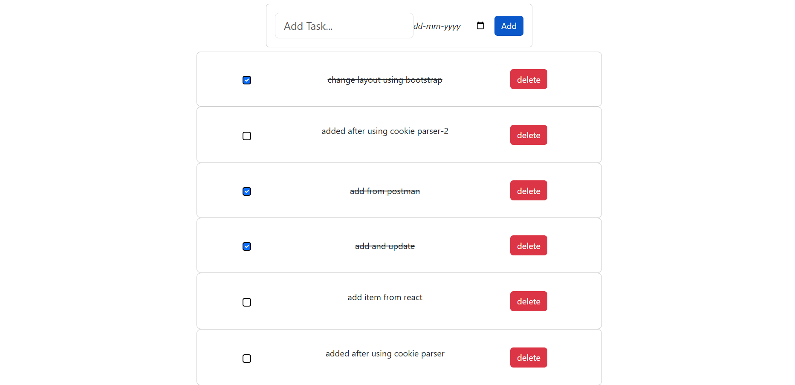

# 📝 Todo Application (Redux + Bootstrap + JWT Auth)

A full-stack Todo application built using React, Redux Toolkit, Bootstrap, Node.js, Express, MongoDB, and JWT authentication.

This version improves on the previous project by integrating:

- ✅ Redux Toolkit for state management
- ✅ Bootstrap for UI styling
- ✅ JWT Authentication with HTTP-only cookies
- ✅ Protected Routes
- ✅ Full CRUD operations for Todos

---

## 🚀 Tech Stack

### Frontend
- React
- Redux Toolkit
- React Router
- Bootstrap
- Fetch API

### Backend
- Node.js
- Express.js
- MongoDB (Mongoose)
- JWT Authentication
- bcrypt
- cookie-parser
- CORS

---

## 🔐 Features

- User Signup
- User Login (JWT stored in HTTP-only cookies)
- Authentication middleware
- Protected routes
- Add Todo
- Delete Todo
- Mark Todo as Completed
- View All Tasks
- View Pending Tasks
- Redux-based global state management
- Loading indicators

## 📸 Screenshots

### 🔑 Login Page

